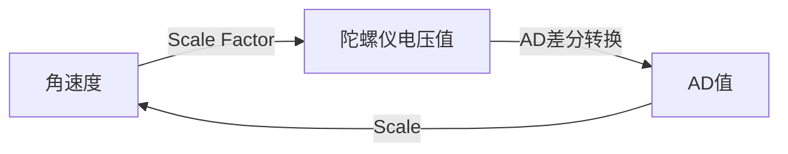

# 定位总结 

## 仪器介绍

### 光纤陀螺仪 

---

**陀螺仪原理简介**：光纤陀螺仪是基于[Sagnac效应 ](https://baike.baidu.com/item/Sagnac%E6%95%88%E5%BA%94/10679850?fr=aladdin)检测角速度的装置 。陀螺仪将角速度转换为陀螺仪电压，再经过AD、采集转换输出信号量。

#### 1.VG910 & VG103PT

* 1.1 陀螺仪参数简介

  ---

  * 采样周期 *Sample  Time* ： ADC完成数字量转换并读取的时间[计算方法 ](https://blog.csdn.net/black0591/article/details/103187450)
  * 阈值*Threshold*：在采样时间内陀螺仪能检测到的最大AD值，即陀螺仪在采样时间内检测到的最小角速度对应的AD值
  * 零点*Zero Point*：陀螺仪静止时输出的AD值
  * 积分系数*Scale*：转动角速度与当前AD值的比例，且

  $$
  \begin{equation} \omega=AD/Scale  \end{equation}
  $$

  * [购买陀螺仪公司的官网](http://www.tuoluoyi.com/)
  * [VG910基本参数](http://www.tuoluoyi.com/show.asp?id=121)
  * [VG103基本参数](http://www.tuoluoyi.com/show.asp?id=123)
  * [VG910参数及上位机链接](https://fizoptika.com/fiber-optic-gyro-documents/)

* 1.2 陀螺仪参数获取方法

  ---

  **实验目的**：

  ​	陀螺仪积分系数与角速度相关，需要在不同转速下测定积分系数与角速度的关系。

  

  **实验原理**：

  ​	根据不同转速下测定积分系数与角速度的关系，得到
  $$
  \begin{equation}
  \omega = \frac{AD}{Scale} \\
  Scale = A*\omega^2 + B*\omega + C \\
  \end{equation}
  $$
  ​	单片机运算能力不足，不能实时根据角度计算积分系数，故我们采取牺牲空间的查表法,保证filted_rate从1~1500变化时都有对应的积分系数表。
  $$
  \begin{equation}
  \omega = 0:suitable\_num:150\\
  Scale = Scale(\omega)\\
  AD = Scale(\omega)*\omega\\
  filted\_rate = AD*Sample\_Time
  \end{equation}
  $$
  
**实验准备**： 
  
1. 电机：常用EC。要求：电机与轴间隙必须小，转动速度稳定 ；
  2. 铝架：稳定平放地面即可；
  3. 细电源线 ，电池，采集顶板，jlink，电机顶板。
  4. [陀螺仪积分系数标定.xlsx](../assets/template/陀螺仪积分系数标定.xlsx)
  

  
实验步骤：
  
1. **接线**：以EC为例，RS232线接电脑和顶板，注意别接反。上位机最多只能识别到COM8，若电脑几个串口序号均大于8，换电脑或连接拓展坞；
  
  2. **测定**：
  
     ~~~
     1. 选择程序：VG910用spi发送信息，VG103用usart发送信息，标不同陀螺仪需要选择对应程序。
     2. 消除间隙：由于存在减速器间隙，每次标定前，将电机使能，再让陀螺仪转过间隙角（以逆时针举例），reset置零。确保陀螺仪没零漂后在上位机输入相应参数.速度在表格中有，角度值是75111.(上位机角度栏只允许输入整数)。转动过程中注意理线，别让线给陀螺仪施加额外的力，转弯一圈后将陀螺仪逆时针转动间隙角，电池和线的位置需要与初始状态保持一致。读取陀螺仪角度值，记录。
     ~~~
  
  3. **拟合**：拟合积分系数和角速度的关系，一般二次函数拟合，再让 filted_rate对应积分系数。
  
     ~~~
     21-4-5更新：
     可以直接拟合积分系数和filted_rate的函数关系，如果拟合的R方大于0.997，认为标定效果很好。此时正反转差值不超过0.1°。
     ~~~
  
  4. **检验**：给定不超过量程任意角速度测试陀螺仪输出转角，一般让陀螺仪转360。若在不同角速度下陀螺仪输出角度误差不超过0.3°，标定结束。
  
  5. [0405陀螺仪积分系数标定.xlsx](../assets/template/VG910_Scale.xlsx)

### 码盘

#### 编码器介绍

​	编码器简单来说是输出脉冲的计数器，其种类繁多，有增量式和绝对值式，还有磁编和光电编码器。具体可以自行百度或者参见ppt。定位组码盘上使用的是500线的光电增量式编码器。可参见[安华高公司官网](https://www.broadcom.cn/)。

#### 垂直码盘

​	约定轮径系数为码盘走一圈输出的距离/脉冲数。虽然理论上可以直接量出轮子的周长再除以编码器线数，但码盘易受周围环境影响，需要综合场地因素确定轮径系数。

​	码盘是易损品，基本用一年的比赛就已经磨损了。机械组可以做，需要注意制作出来的码盘不能有轴向间隙。

## 定位原理介绍

### 联合标定

联合标定原理分为三个部分：

1. [从码盘坐标换算小车坐标](../assets/pdf/代码模型.pdf)

2. [码盘运动关系和小车运动关系的转换](../assets/pdf/直线解算及模型反算.pdf)

3. [跑四个方向的标定方法](../assets/pdf/联合标定原理.pdf)

   三个部分并不是相互独立的，建议初学者按顺序看，熟练以后可以直接看3.

### 圆弧更新

​	圆弧更新是对直线更新的细化，难点在于模型反算。受限于实验精度，模型反算误差会比较大。

* [圆弧更新](../assets/pdf/圆弧解算及模型反算.pdf)
  * 圆弧标定可以正转180，也可以反转180，但正反转算出来结果相差较大，且只有一组比较准。
  * 之前想过用梯度下降法将损失迭代到最小，但效果一直不好。具体程序可参见TR一代车里面的cir_grad.m文件。

## 定位流程

​	为方便定位组成员快速上手，在2021年标定两辆车时都有做详细的步骤记录。实验时不妨以[这个流程](../web/assets/code/2021TR/process.md)为参考，避免走弯路。一些模板表格也已经整理出来放在template目录下。

### 一些提醒

1. 码盘是易损品，需要及时更新。码盘的轮子擦一擦误差就会小一些，证明场地上的灰尘等会影响定位精度，所以需要根据场地确定轮径系数。

2. 一套陀螺仪+板子价值两三万，而且陕西测控的板子已经绝版了，使用的时候要尤其小心。

   

