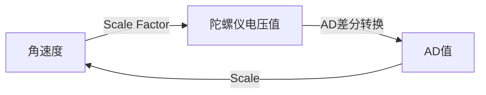

# 定位总结 

## 仪器介绍

### 光纤陀螺仪 

---

**陀螺仪原理简介**：光纤陀螺仪是基于[Sagnac效应 ](https://baike.baidu.com/item/Sagnac%E6%95%88%E5%BA%94/10679850?fr=aladdin)检测角速度的装置 。陀螺仪将角速度转换为陀螺仪电压，再经过AD、采集转换输出信号量。

#### 1.VG910 & VG103PT

* 1.1 陀螺仪参数简介

  ---

  * 采样周期 *Sample  Time* ： ADC完成数字量转换并读取的时间[计算方法 ](https://blog.csdn.net/black0591/article/details/103187450)

  * 阈值*Threshold*：在采样时间内陀螺仪能检测到的最大AD值，即陀螺仪在采样时间内检测到的最小角速度对应的AD值

  * 零点*Zero Point*：陀螺仪静止时输出的AD值

  * 积分系数*Scale*：转动角速度与当前AD值的比例，且

  * $$
    \begin{equation} \omega=AD/Scale  \end{equation}
    $$

* [VG910基本参数](https://b2b.bjx.com.cn/product-267301.html)

* [VG910参数及上位机链接](https://fizoptika.com/fiber-optic-gyro-documents/)

* 1.2 陀螺仪参数获取方法

  ---

  实验目的：

  ​	陀螺仪积分系数与角速度相关，需要在不同转速下测定积分系数与角速度的关系。

  

  实验原理：

  ​	根据不同转速下测定积分系数与角速度的关系，得到
  $$
  \begin{equation}
  \omega = \frac{AD}{Scale} \\
  Scale = A*\omega^2 + B*\omega + C \\
  \end{equation}
  $$
  ​	单片机运算能力不足，不能实时根据角度计算积分系数，故我们采取牺牲空间的查表法,保证filted_rate从1~1500变化时都有对应的积分系数表。
  $$
  \begin{equation}
  \omega = 0:suitable\_num:150\\
  Scale = Scale(\omega)\\
  AD = Scale(\omega)*\omega\\
  filted\_rate = AD*Sample\_Time
  \end{equation}
  $$
  

  实验仪器： 

  1. 电机：常用EC。要求：电机与轴间隙必须小，转动速度稳定 ；
  2. 铝架：稳定平放地面即可；
  3. 细电源线 ，电池，采集顶板，jlink。 
  4. 陀螺仪标定.xlsx

  

  实验步骤：

  1. 接线：根据采集顶板选择程序。蓝色顶板 选择带com的程序，绿色选择带spi的；
  2. 测定：利用电机上位机使陀螺仪在任意角速度下转360度，在debug窗口观测陀螺仪输出角度值。确保陀螺仪没零漂后，从2～150或300度 /s，每隔5度/s在excel中记录陀螺仪输出角度值。注意不要让线缠在一起，影响精度且可能弄断线 ；
  4. 拟合：拟合积分系数和角速度的关系，一般二次函数拟合，再让 filted_rate对应积分系数。
  4. 检验：给定不超过量程任意角速度测试陀螺仪输出转角，一般让陀螺仪转360。若在不同角速度下陀螺仪输出角度误差不超过0.3°，标定结束。

### 码盘

#### 编码器介绍

编码器简单来说是输出脉冲的计数器，其种类繁多，有增量式和绝对值式，还有磁编和光电编码器。具体可以自行百度或者参见ppt。定位组码盘上使用的是500线的光电增量式编码器。

## 定位原理介绍

### 联合标定

参见pdf
[代码模型.pdf](../assets/pdf/代码模型.pdf)

### 圆弧更新

@import  "test.svg"

## 定位流程

参见md

