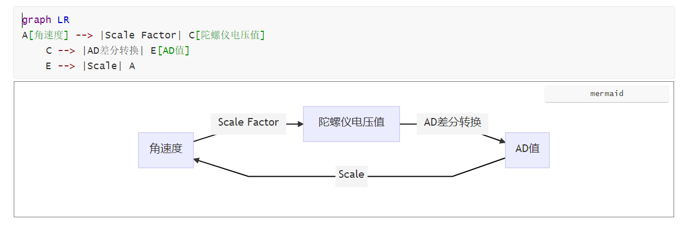
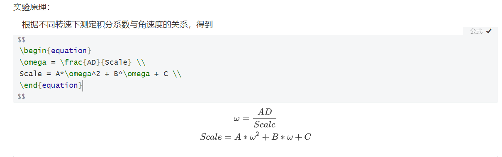

# 定位组官网使用教程

## 准备Github账号

1. 登录[Github](https://github.com/)，sign in

2. 将用户名发送至定位小群，管理员将给予该账号master权限。

## Git安装

1. 下载[git](https://git-scm.com/)
2. 配置。除了修改安装路径之外一路next即可。
3. 检查。鼠标右键，出现git bash here即为安装成功。

## Git使用

1. 新建文件夹，作为定位组官网的本地仓库。

2. 打开文件夹，右键git bash here。

3. 创建本地仓库并配置用户信息

   `git init` 

   `git config --global user.name "username" `

   ` git config --gloabal user.email "emailAddress"`

   `git remote add origin git@github.com:whu-robocon-location/whu-robocon-location.github.io.git`

   //这一步是配置ssh密钥（git remote add origin ssh）。ssh可以验证用户身份，且保证文件安全传输。ssh可以在github的仓库里点击code->ssh->复制ssh链接得到，以上ssh是定位组官网的ssh。

   `git pull origin master`

   `git branch --set-upstream-to=origin/master`

4.  同步定位组官网内容

   `git pull //拉取定位组官网内容`

5. 在本地增加内容

   在_post文件夹中增加自己的日志内容，命名需要与已有的md文件格式一致(年-月-日-标题.md)，md文件前面几行的tag等均属于yaml头，具体可自行百度。

6. 上传本地内容

   assets放置md中可能出现的各类文件，目前不能显示pdf。

   `git add .//将本地内容上传到git暂存区详见，git add命令`

   `git commit -m "operating_name//确定更改，详见git commit命令"`

   `git push//将代码从暂存区推到仓库`

   `git status//查看仓库状态，一般不需要看`

## Markdown书写技巧

1. 插入流程图mermaid

   

   [学习链接](https://www.jianshu.com/p/7ddbb7dc8fec)

   注意，插入代码块之后右下角可能出现rust或者选择语言按钮，在方框内输入对应的语言即可。比如上图就是mermaid，之后可能用到flow。

2. 插入数学公式

   

   使用和latex几乎没有区别，只是额外加了美元符号。

3. 插入pdf（仅限vscode+markdown preview enhanced）

   方法一：将pdf转换为svg然后在md中import
   通过[网站](https://convertio.co/zh/pdf-svg/ )得到svg格式（eg: test.svg)，然后在vscode输入`@import 'test.svg'`，用markdown preview enhanced打开即可。需要注意，import引用目录不得超过3层，如@import "web/assets/pdf/test.svg"无法显示。
   方法二：配置pdf2svg，然后import。鉴于windows配置pdf2svg麻烦且不稳定，建议直接用方法一手工转换

   未实验的方法： [link1](https://github.com/abemedia/jekyll-pdf)   [link2](https://blog.csdn.net/pizi0475/article/details/52274330)

## 定位组官网美化

1. 展示页的目录结构

   在Readme.md文件里修改即可同步到目录结构。如，希望在skills页面中加入DT，直接在readme中找到对应项按照原有格式添加。

2. 其他细节

   细节部分全部在config.yml里面。包括背景、头像、看板娘等前端渲染的东西，也包括latex插件、mermaid、百度爬虫链接支持。由于是自定义的东西，不再赘述，自行百度

3. 更换主题

   登录[Jekyll](http://jekyllthemes.org/)选择自己喜欢的主题。（也可以在创建github pages时选择默认主题）每一个主题的详细配置教程不同，直接进入创建者的github page看readme.md学习就行。

4. 注意

   * 注意post文件夹下的1999开头的几个md文件，*它们很重要*，是直接决定索引是否成功的关键。如果需要修改，请直接进入md文件内的perlink修改链接。
   * github上查看大文件时需要翻墙，所以各种图片等显示不出来是正常现象。可以F12查看控制台元素，会发现报错说链接错误，这就是翻墙失败或者dns污染的结果。
   * 网页中的pdf或者png等大文件可能无法加载，这是因为github会墙大文件。翻过去就好了。
4. 补充

   定位组官网是用来存放代码、保留学习笔记的云平台。实用性是首要的，美观是次要的，后续可以积极探索各种插件支持，如latex等。

更新时间：2021/3/7

author:Nancy